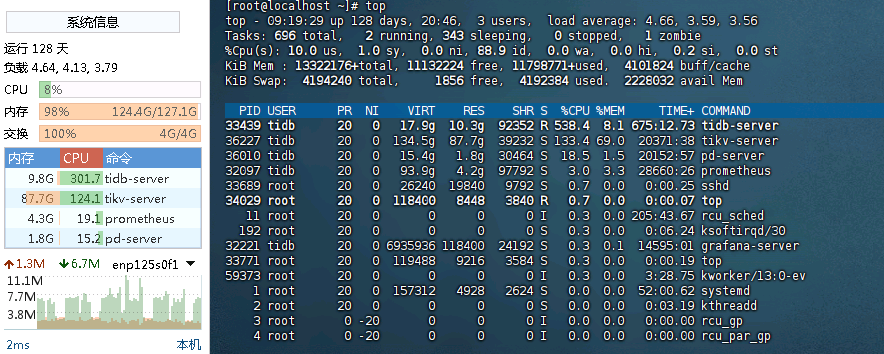
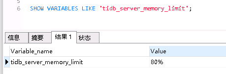
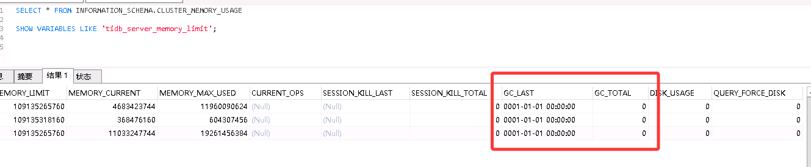
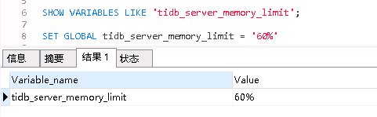

## 1. 背景

前不久我们的平台应用经常出现前端页面卡顿，接口调用报错的情况，让我去排查下问题。

于是按照常规的思路，先看服务日志，在日志中发现有大量的数据库连接被拒绝的错误日志：

```text
Caused by: java.net.ConnectException: Connection refused (Connection refused)
at java.net.PlainSocketImpl.socketConnect(Native Method)
at java.net.AbstractPlainSocketImpl.doConnect(AbstractPlainSocketImpl.java:476)
at java.net.AbstractPlainSocketImpl.connectToAddress(AbstractPlainSocketImpl.java:218)
at java.net.AbstractPlainSocketImpl.connect(AbstractPlainSocketImpl.java:200)
at java.net.SocksSocketImpl.connect(SocksSocketImpl.java:394)
at java.net.Socket.connect(Socket.java:606)
at com.mysql.cj.protocol.StandardSocketFactory.connect(StandardSocketFactory.java:153)
at com.mysql.cj.protocol.a.NativeSocketConnection.connect(NativeSocketConnection.java:62)
... 9 common frames omitted
```

然后开始查看网络问题，测试与服务器与数据库的连通性，发现没有问题，能ping通，端口也是通的。应用服务器的状态也是正常的。(
忘截图了)

接着就是查看数据库的状态，一连上就发现内存基本吃满了，占用最高的为tikv-server，查看日志发现存在OOM的情况，基本可以断定这就是无法建立连接的原因了。



由于平台建设还不全面，监控也不完善，内网环境还没法发送告警，也就没有发现数据库的问题。

## 2. 排查过程

### 2.1 查看tidb-server内存相关的参数

按理说数据库都会限制内存使用的，不应该会占用过多的内存，大概率是设置得不合理。

查看tidb_server_memory_limit的值：80%。



查看数据库GC的情况，发现GC_LAST时间为0001-01-01 00:00:00，也就是没有触发GC，当前tidb-server的内存占用确实也没有达到限制值。

```sql
SELECT * FROM INFORMATION_SCHEMA.CLUSTER_MEMORY_USAGE
```



尝试下调这个参数到60%，然后重启tidb-server，观察内存变化。




发现果然没有效果，所以我们需要把重心放到tikv-server上。


### 2.2 查看tikv-server内存相关的参数

从tidb的metrics中查看kv内存相关的数据，发现tikv_engine_block_cache_size_bytes占用了57G的内存。

```text
tikv_engine_block_cache_size_bytes{cf="all",db="kv"} 61378059808
```

在官方文档上搜索相关参数：


我们使用的engine为raft-kv，默认值为系统内存的45%，而我们的服务器内存为128G，70%就是57G左右，但是由于服务器还部署了其他服务，所以这个值显然过高了。


尝试下调这个参数到20G，然后重启tikv-server，观察内存变化。


果然内存总占用果然下降了，稳定在60多G后不再增长，也不再出现应用服务连不上数据库的情况。

还有一个重要参数memory-usage-limit需要了解一下，我们服务器内存为128G，75%就是96G，显然我们服务器是没法达到这个值，所以这个参数也需要下调。


## 3. 总结

通过这次排查，发现数据库的内存参数设置不合理，导致内存占用过高，进而引发应用服务无法连接数据库的问题。通过下调tikv-server的缓存相关参数，成功解决了问题。


