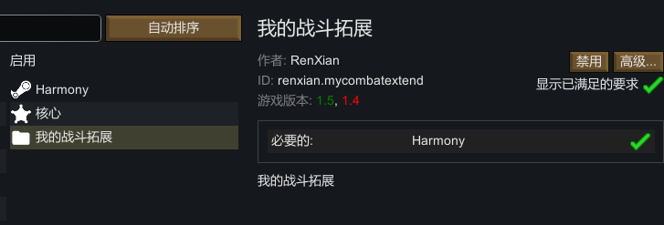

## 一、模组的开发方式

对环世界的游戏内容进行调整有如下三种方法：

1. **XML补丁**：
    - 通过修改游戏的Defs（数据定义文件）来实现对游戏元素的添加或修改。
    - 这种方式不需要修改游戏本体，适合简单的修改和添加。
2. **C#代码的Mod**
    - 通过编写C#代码来实现更复杂的功能和逻辑。
    - 这种方式需要对C#编程有一定了解，适合需要深度修改游戏逻辑的情况。
3. **Harmony补丁**
    - 使用Harmony库来修改游戏的C#代码。
    - 这种方式可以在不修改游戏本体的情况下，对游戏逻辑进行深度修改。

在模组开发中，以上三种方式都可能会用到，据情况选择不同的方案。

## 二、模组的创建

### 1. 模组存放位置

游戏的安装目录一般位于“Steam安装目录\steamapps\common\RimWorld”，以下简称为“安装目录”

- 来源于文件的模组存放在“安装目录\Mods”
- 来源于创意工坊的模组存放在“Steam安装目录\steamapps\workshop\content\294100”

### 2. 模组目录结构

模组的目录结构通常如下所示：

```text
MyMod :模组名称
 :版本通用的文件夹
 - About :包含模组信息文件信息
    - About.xml :声明模组信息（必须）
 - Assemblies :包含编译后的C#代码文件
 - Defs :包含各种Defs
 - Patches :包含对Defs的补丁文件
 - Languages :包含模组的语言文件
 - Sounds :包含模组的音效文件
 - Textures :包含模组的素材
 
 :适用于不同版本的文件夹，当游戏版本为1.4时，优先使用1.4文件夹下的内容
 - 1.4
    - Assemblies
    - Defs
    - Patches
    - Languages
    ...
```

### 3. 案例

1.首先我们在“安装目录\Mods”下创建如下目录结构：

```text
MyCombatExtend
 - About
    - About.xml
```

2.模组的About.xml文件包含了模组的基本信息，如名称、作者、版本等。以下是一个示例：

```xml
<?xml version="1.0" encoding="utf-8"?>

<ModMetaData>
    <name>我的模组</name> <!--模组名称-->
    <description>一个简单的模组</description> <!--模组描述-->
    <author>RenXian</author> <!--作者-->
    <supportedVersions> <!--支持的版本-->
        <li>1.4</li>
        <li>1.5</li>
    </supportedVersions>
    <packageId>RenXian.MyMod</packageId> <!--包名-->
</ModMetaData>
```

3.然后进入游戏，就能看到我们的模组了。



不过你会在控制台中看到一些错误信息，这是因为我们没有添加任何实际的东西，它会提示你`not load any content`。
