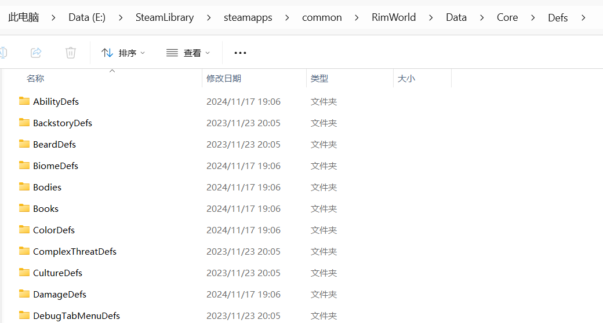

在XML补丁开发之前，我们需要先对Defs有一个基本的了解。

## 一、 什么是Defs

Defs是环世界（RimWorld）游戏中的数据定义文件，使用XML格式存储。它们定义了游戏中的各种元素，如物品、建筑、植物、动物等。通过修改这些Defs文件，可以实现对游戏内容的添加或修改。

### 1. Defs存放位置

位置：安装目录\Data\DLC目录\Defs

例如：E:\SteamLibrary\steamapps\common\RimWorld\Data\Core\Defs



### 2. Defs讲解

“安装目录\Data\Core\Defs\ThingDefs_Plants\Plants_Cultivated_Farm.xml”中定义了可以栽培的作物，我们拿第一个作物“Plant_Rice”(水稻)作为示例：

可以看到“Plant_Rice”的Def包含了作物的名称、标签、描述、统计数据、图形数据、种植信息等，这里对一些常用的信息进行说明。

```xml

<ThingDef ParentName="PlantBase">
    <defName>Plant_Rice</defName>
    <label>rice plant</label>
    <description>A short, fast-growing crop that yields small edible grains. Its great nutritional output and ease of
        cultivation has made it the economic core of many great civilizations. While rice grows quickly, it is sensitive
        to soil fertility and will not fare well in poor soil.
    </description>
    <statBases>
        <MaxHitPoints>85</MaxHitPoints> <!--最大耐久度-->
        <Nutrition>0.175</Nutrition> <!--营养值-->
    </statBases>
    <graphicData>
        <texPath>Things/Plant/RicePlant</texPath>
        <graphicClass>Graphic_Random</graphicClass>
    </graphicData>
    <selectable>true</selectable>
    <pathCost>14</pathCost>
    <ingestible/>
    <plant>
        <immatureGraphicPath>Things/Plant/RicePlant_Immature</immatureGraphicPath>
        <dieIfLeafless>true</dieIfLeafless>
        <maxMeshCount>4</maxMeshCount>
        <harvestTag>Standard</harvestTag>
        <harvestedThingDef>RawRice</harvestedThingDef> <!--产出的物品-->
        <harvestYield>6</harvestYield> <!--产出的数量-->
        <sowTags> <!--可以种植的位置-->
            <li>Ground</li> <!--地面-->
            <li>Hydroponic</li> <!--水栽培-->
        </sowTags>
        <topWindExposure>0.1</topWindExposure>
        <growDays>3</growDays> <!--生长时间-->
        <visualSizeRange>0.5~0.8</visualSizeRange>
        <wildOrder>2</wildOrder>
        <purpose>Food</purpose>
        <humanFoodPlant>true</humanFoodPlant>
    </plant>
</ThingDef>
```

“Plant_Rice”继承了“安装目录\Data\Core\Defs\ThingDefs_Plants\Plants_Bases.xml”中的“PlantBase”，“PlantBase”继承了“PlantBaseNonEdible”，这样可以复用一些通用的属性，同时也能进行属性的覆盖。

```xml

<ThingDef Name="PlantBaseNonEdible" Abstract="True">
    <category>Plant</category>
    <thingClass>Plant</thingClass>
    <altitudeLayer>LowPlant</altitudeLayer>
    <useHitPoints>True</useHitPoints>
    <statBases>
        <Flammability>1</Flammability>
        <BeautyOutdoors>1</BeautyOutdoors>
    </statBases>
    <tickerType>Long</tickerType>
    <selectable>False</selectable>
    <neverMultiSelect>True</neverMultiSelect>
    <drawerType>MapMeshOnly</drawerType>
    <pathCostIgnoreRepeat>false</pathCostIgnoreRepeat>
    <graphicData>
        <graphicClass>Graphic_Random</graphicClass>
        <shaderType>CutoutPlant</shaderType>
    </graphicData>
    <plant>
        <fertilityMin>0.7</fertilityMin>
        <fertilitySensitivity>1.0</fertilitySensitivity>
        <soundHarvesting>Harvest_Standard</soundHarvesting>
        <soundHarvestFinish>Harvest_Standard_Finish</soundHarvestFinish>
        <sowWork>170</sowWork>
        <harvestWork>200</harvestWork>
        <visualSizeRange>0.3~1.00</visualSizeRange>
        <topWindExposure>0.1</topWindExposure>
    </plant>
    <thingCategories>
        <li>Plants</li>
    </thingCategories>
</ThingDef>

<ThingDef ParentName="PlantBaseNonEdible" Name="PlantBase" Abstract="True">
<ingestible>
    <foodType>Plant</foodType>
    <preferability>RawBad</preferability>
</ingestible>
</ThingDef>
```

### 3. 如何修改Defs

修改Defs通常有两种方式：

1. **直接修改**：直接在游戏安装目录下的Defs文件夹中修改xml文件。这种方式不推荐，因为会影响游戏本体，且在游戏更新时可能会被覆盖。
2. **使用补丁**：通过创建一个补丁文件，使用补丁的方式来修改或添加Defs。这种方式更安全，不会影响游戏本体，并且可以在游戏更新时保持兼容。

由于是讲模组开发，所有我们这里使用打补丁的方式进行修改Defs。

### 4. 使用补丁修改Defs

补丁的具体规则参照[补丁说明](https://www.rimworldwiki.com/wiki/Modding_Tutorials/PatchOperations)。

#### 案例1：修改“Plant_Rice”的生长时间，将其从3天改为2天。

我们在模组文件的Patches中创建ChangePlantGrowDays.xml文件

```text
MyMod
  - Patches
    - ChangePlantGrowDays.xml
```

在ChangePlantGrowDays.xml文件中添加以下内容：

```xml
<?xml version="1.0" encoding="utf-8"?>
<Patch>
    <Operation Class="PatchOperationReplace"> <!--使用Replace操作-->
        <xpath>/Defs/ThingDef[defName = "Plant_Rice"]/plant/growDays</xpath> <!--使用xpath定位Defs中的数据-->
        <value>
            <growDays>2</energyPerSecond> <!--替换生长时间为2天-->
        </value>
    </Operation>
</Patch>
```

#### 案例2：我们让“Plant_Corn”（玉米）也可以种植在水栽培中。

我们在模组文件的Patches中创建ChangePlantSowTags.xml文件

```text
MyMod
  - Patches
    - ChangePlantSowTags.xml
```

在ChangePlantSowTags.xml文件中添加以下内容：

```xml
<?xml version="1.0" encoding="utf-8"?>
<Patch>
    <Operation Class="PatchOperationAdd"> <!--使用Add操作-->
        <xpath>/Defs/ThingDef[defName = "Plant_Corn"]/plant/sowTags</xpath>
        <value>
            <li>Hydroponic</li> <!--水栽培-->
        </value>
    </Operation>
</Patch>
```

### 5. 总结

在Patches目录创建XML补丁可以实现对游戏Defs的修改或添加，是最简单的一种方式，同时也是修改游戏中基础数据最有效的方式，交由大家自行探索。
