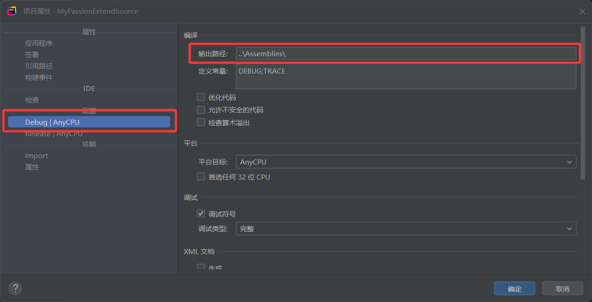
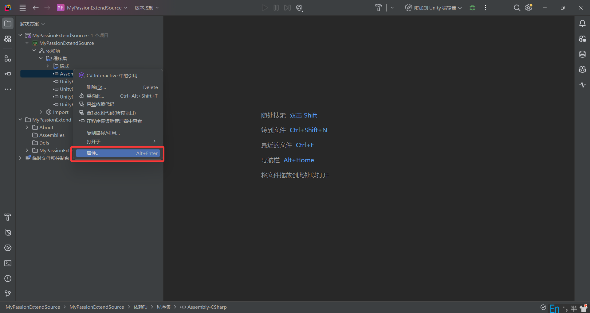

本节我们做一个人物兴趣拓展模组来讲C#模组的开发。该模组新增一个提升人物兴趣等级的物品，并让其能够通过贸易获得。

## 一、环境准备

### 1. 安装Rider

Rider下载地址：[Rider下载](https://www.jetbrains.com/rider/download/)。

熟悉的可以使用Visual Studio或者其他IDE。

### 2. .NET4.8安装

.NET版本选择4.8，下载地址：[.NET4.8下载](https://dotnet.microsoft.com/zh-cn/download/dotnet-framework/net48)

## 二、创建模组

### 1. 创建模组文件

在`安装目录\Mods`文件夹中创建一个新的模组文件夹，命名为`MyPassionExtend`，模组的目录结构如下：

```text
MyPassionExtend
 - About
   - About.xml
 - Assemblies
 - Defs
 - Languages
```

### 2. 编写About.xml文件

在`About.xml`文件中写入以下内容：

```xml
<?xml version="1.0" encoding="utf-8"?>

<ModMetaData>
    <name>人物兴趣拓展</name> <!--模组名称-->
    <description>人物兴趣拓展</description> <!--模组描述-->
    <author>RenXian</author> <!--作者-->
    <supportedVersions> <!--支持的版本-->
        <li>1.4</li>
        <li>1.5</li>
    </supportedVersions>
    <packageId>RenXian.MyPassionExtend</packageId> <!--包名-->
</ModMetaData>
```

此时，我们进入游戏后就能看到我们的模组了


### 3. 创建项目文件

#### 1. 新建项目

1. 使用Rider在`MyPassionExtend`目录下创建项目文件
2. 选择C#`类库`项目类
3. 解决方案和项目都命名为`MyPassionExtendSource`
4. 勾选`将解决方案和项目放在同一目录中`
5. 目标框架选择`v4.8`
6. 语言选择`C#`
7. 类型为`Empty`


### 4. 添加附加文件

1. 右击`解决方案`
2. 选择`添加`
3. 选择`现有文件`
4. 选择`安装目录\Mods\MyPassionExtend`


附加后就可以在项目中看到模组目录下的文件了。


### 5. 修改项目属性

右击`项目`，选择`属性`，修改项目的属性。


调整语言版本，这里选择默认即可，熟悉的人可以根据需要调整。


修改项目的输出目录，调整`Debug`和`Release`的输出路径为模组目录下的Assemblies文件夹。



### 6. 添加依赖

本次案例依赖`安装目录\RimWorldWin64_Data\Managed`下的五个DLL文件：

- Assembly-CSharp.dll
- UnityEngine.dll
- UnityEngine.CoreModule.dll
- UnityEngine.IMGUIModule.dll
- UnityEngine.TextRenderingModule.dll

操作如下：

- 右击项目下的`依赖项`
- 选择`引用`
- 选择`添加自`
- 按`Ctrl`多选上面的DLL文件


### 7. 修改依赖项属性

对添加的所有依赖修改属性，取消`复制本地`选项。




觉得麻烦的可以直接在项目的.csproj文件的ItemGroup中添加以下内容：

```xml

<ItemGroup>
    <Reference Include="Assembly-CSharp">
        <HintPath>..\..\..\RimWorldWin64_Data\Managed\Assembly-CSharp.dll</HintPath>
        <Private>False</Private>
    </Reference>
    <Reference Include="UnityEngine">
        <HintPath>..\..\..\RimWorldWin64_Data\Managed\UnityEngine.dll</HintPath>
        <Private>False</Private>
    </Reference>
    <Reference Include="UnityEngine.CoreModule">
        <HintPath>..\..\..\RimWorldWin64_Data\Managed\UnityEngine.CoreModule.dll</HintPath>
        <Private>False</Private>
    </Reference>
    <Reference Include="UnityEngine.IMGUIModule">
        <HintPath>..\..\..\RimWorldWin64_Data\Managed\UnityEngine.IMGUIModule.dll</HintPath>
        <Private>False</Private>
    </Reference>
    <Reference Include="UnityEngine.TextRenderingModule">
        <HintPath>..\..\..\RimWorldWin64_Data\Managed\UnityEngine.TextRenderingModule.dll</HintPath>
        <Private>False</Private>
    </Reference>
</ItemGroup>
```

## 三. 编写代码

### 1. 功能流程


### 2. 编写对话框类

在项目下创建`Dialog.cs`文件，写入以下内容：

```csharp
using UnityEngine;
using Verse;

namespace MyPassionExtendSource;

/**
 * 一个基础的对话框类，描述对话框的基本结构和行为，具体逻辑由子类实现
 */
public class Dialog : Window {
    /**
     * 对话框的标题高度
     */
    private float headerHeight = 32f;
    /**
     * 内容区域的内边距
     */
    private float wrapperPadding = 16f;

    /**
     * 内容区域的滚动高度
     */
    protected float scrollHeight;
    /**
     * 内容区域的滚动位置
     */
    protected Vector2 scrollPosition;

    /**
     * 获取对话框的标题
     */
    public virtual string GetTitle() {
        return null;
    }

    /**
     * 检查是否可以确认
     */
    public virtual bool CanConfirm() {
        return false;
    }

    /**
     * 取消当前选择
     */
    public virtual void OnCancel() {
    }

    /**
     * 确认当前选择
     */
    public virtual void OnConfirm() {
    }

    /**
     * 在对话框内容区域绘制具体的内容
     * @param inRect 内容区域的矩形
     */
    public virtual void DoDialogContents(Rect inRect) {
    }

    /**
     * 实现Window类的DoWindowContents方法，绘制对话框的窗口内容
     */
    public override void DoWindowContents(Rect rect) {
        // 设置字体大小
        Text.Font = GameFont.Medium;
        // 绘制标题
        Widgets.Label(rect, GetTitle());

        // 调整矩形区域，留出标题和按钮空间
        rect.yMin += headerHeight;
        rect.yMax -= CloseButSize.y;

        // 创建一个矩形区域用于包裹内容
        Rect wrapper = new(0f, headerHeight, rect.width, rect.height - 6f);
        wrapper.xMin += wrapperPadding;

        GUI.BeginGroup(wrapper);

        // 绘制滚动视图
        Rect content = new(0f, 0f, wrapper.width - wrapperPadding, scrollHeight);
        Widgets.BeginScrollView(wrapper.AtZero(), ref scrollPosition, content);
        DoDialogContents(content with { y = scrollPosition.y, height = wrapper.height });
        Widgets.EndScrollView();

        GUI.EndGroup();

        // 添加关闭按钮
        if (Widgets.ButtonText(new Rect(rect.xMax - CloseButSize.x, rect.yMax, CloseButSize.x, CloseButSize.y),
                "Close".Translate())) {
            OnCancel();
            Close();
        }

        // 添加确认按钮
        if (Widgets.ButtonText(
                new Rect(rect.xMax - CloseButSize.x * 2 - 6f, rect.yMax, CloseButSize.x, CloseButSize.y),
                "Confirm".Translate(), active: CanConfirm())) {
            OnConfirm();
            Close();
        }
    }
}
```

### 3. 编写技能选择对话框类

在项目下创建`Dialog_SkillSelector.cs`文件，写入以下内容：

```csharp
using System;
using RimWorld;
using UnityEngine;
using Verse;

namespace MyPassionExtendSource;

/**
 * 用于选择人物的技能的对话框
 */
public class Dialog_SkillSelector : Dialog {
    /**
     * 所选技能
     */
    private SkillDef selectedSkill;
    /**
     * 确认选择的回调
     */
    private Action<SkillDef> confirmed;
    /**
     * 取消选择的回调
     */
    private Action cancelled;
    /**
     * 过滤技能的函数
     * 如果为null，则不过滤
     */
    private Func<SkillDef, bool> filter;

    public Dialog_SkillSelector(Action<SkillDef> confirmed = null, Action cancelled = null, Func<SkillDef, bool> filter = null) {
        this.confirmed = confirmed;
        this.cancelled = cancelled;
        this.filter = filter;
        // 打开对话框时，暂停游戏
        forcePause = true;
    }

    /**
     * 获取对话框的标题
     */
    public override string GetTitle() {
        return "SelectSkill".Translate(); // 进行翻译，Languages下的Keyed中
    }

    /**
     * 没有选择技能时，不能确认
     */
    public override bool CanConfirm() {
        return selectedSkill != null;
    }

    /**
     * 确认时调用回调函数，并传入所选技能，恢复游戏
     */
    public override void OnConfirm() {
        confirmed?.Invoke(selectedSkill);
        forcePause = false;
    }

    /**
     * 取消时调用回调函数，恢复游戏
     */
    public override void OnCancel() {
        cancelled?.Invoke();
        forcePause = false;
    }

    /**
     * 在对话框内容区域绘制具体的内容
     */
    public override void DoDialogContents(Rect inRect) {
        Text.Font = GameFont.Small;
        float y = 0f;
        // 遍历所有技能定义
        foreach (SkillDef skill in DefDatabase<SkillDef>.AllDefsListForReading) {
            // 进行过滤
            if (filter != null && !filter(skill)) {
                continue;
            }

            // 绘制技能的选择按钮
            if (Widgets.RadioButton(new Vector2(0f, y), skill == selectedSkill)) {
                selectedSkill = skill;
            }

            // 绘制技能的标签
            Widgets.Label(new Rect(30f, y, inRect.width * 0.8f, 30f), skill.LabelCap);
            y += 30f;
        }


        if (Event.current.type == EventType.Layout)
            scrollHeight = y;
    }
}
```

### 4. 编写使用效果类

在项目下创建`Comp_PassionBooster.cs`文件，该类在Defs中会使用，写入以下内容：

```csharp
using RimWorld;
using Verse;

namespace MyPassionExtendSource;

/**
 * 兴趣提升器的使用效果组件，继承自CompUseEffect
 */
public class Comp_PassionBooster : CompUseEffect {

    public Comp_PassionBooster() {
        
    }

    /**
     * 使用效果：选择使用者的一个技能，并提升其兴趣级别
     * @param usedBy 使用者
     */
    public override void DoEffect(Pawn usedBy) {
        base.DoEffect(usedBy);
        // 打开兴趣选择对话框
        Find.WindowStack.Add(new Dialog_SkillSelector(skill => {
            // 获取所选技能的兴趣等级
            Passion passion = usedBy.skills.GetSkill(skill).passion;
            
            // 级别加一，直至最高级别
            if (passion == Passion.None)
                passion = Passion.Minor;
            else if (passion == Passion.Minor)
                passion = Passion.Major;

            // 设置技能的兴趣级别
            usedBy.skills.GetSkill(skill).passion = passion;

            // 销毁使用的物品
            parent.SplitOff(1).Destroy();
        }, filter: skillDef => { // 过滤掉已被完全禁用或已是最高兴趣级别的技能
            return !usedBy.skills.GetSkill(skillDef).TotallyDisabled
                   && usedBy.skills.GetSkill(skillDef).passion != Passion.Major;
        }));
    }
}
```

### 5. 编写物品定义

现在需要创建物品定义来描述兴趣提升器的属性，在`Defs`目录下创建`ThingDefs.xml`

```text
MyPassionExtend
 - Defs
   - ThingDefs.xml 
```

在`ThingDefs.xml`中写入以下内容：

```xml
<?xml version="1.0" encoding="utf-8"?>
<Defs>
    <!--继承“安装目录\Data\Core\Defs\ThingDefs_Items\Items_Resource_Base.xml”中的ResourceBase-->
    <ThingDef ParentName="ResourceBase">
        <!--定义名称-->
        <defName>PassionBooster</defName>
        <!--物品名称-->
        <label>passion booster</label>
        <!--使用后能够提升人对技能的兴趣-->
        <description>When used, it can increase people's passion in skills.</description>
        <!--复用精神训练器的素材-->
        <graphicData>
            <texPath>Things/Item/Special/MechSerumNeurotrainer</texPath>
            <graphicClass>Graphic_Single</graphicClass>
        </graphicData>
        <statBases>
            <!--耐久度-->
            <MaxHitPoints>100</MaxHitPoints>
            <!--市场价值-->
            <MarketValue>1000</MarketValue>
            <!--质量-->
            <Mass>2</Mass>
            <!--可燃-->
            <Flammability>1</Flammability>
        </statBases>
        <!--归类：其他-->
        <thingCategories>
            <li>ItemsMisc</li>
        </thingCategories>
        <!--物品集生成标签：高频回报，用于任务奖励-->
        <thingSetMakerTags>
            <li>RewardStandardHighFreq</li>
        </thingSetMakerTags>
        <!--相关组件-->
        <comps>
            <!--让物品能够被使用-->
            <li Class="CompProperties_Usable">
                <!--引用JobDefs中定义-->
                <useJob>UsePassionBooster</useJob>
                <!--标签：使用兴趣提升器，{0_label}会被替换为物品名称-->
                <useLabel>Use {0_label}</useLabel>
            </li>
            <!--使用效果-->
            <li Class="CompProperties_UseEffect">
                <!--引用编写的组件（命名空间.类名）-->
                <compClass>MyPassionExtendSource.Comp_PassionBooster</compClass>
            </li>
        </comps>
    </ThingDef>
</Defs>
```

### 6. 编写任务定义

在`Defs`目录下创建`JobDefs.xml`

```text
MyPassionExtend
 - Defs
   - JobDefs.xml 
```

在`JobDefs.xml`中写入以下内容：

```xml
<?xml version="1.0" encoding="utf-8"?>
<Defs>
    <JobDef>
        <defName>UsePassionBooster</defName>
        <!--驱动类-->
        <driverClass>JobDriver_UseItem</driverClass>
        <!--指派任务后小人的状态说明，TargetA会替换为使用的物品的名称-->
        <reportString>using TargetA.</reportString>
        <!--允许可能的前缀：xxx正在干什么-->
        <allowOpportunisticPrefix>true</allowOpportunisticPrefix>
    </JobDef>
</Defs>
```

### 7. 编写贸易补丁

在`Patches`目录下创建`TraderKindDefs.xml`，修改贸易的物品列表，添加兴趣提升器。

```text
MyPassionExtend
 - Patches
   - TraderKindDefs.xml 
```

在`Patches\TraderKindDefs.xml`中写入以下内容：

```xml
<?xml version="1.0" encoding="utf-8"?>
<Patch>

    <!--外来殖民者的基地售卖0~1个-->
    <Operation Class="PatchOperationAdd">
        <xpath>/Defs/TraderKindDef[defName = "Base_Outlander_Standard"]/stockGenerators</xpath>
        <value>
            <li Class="StockGenerator_SingleDef">
                <thingDef>PassionBooster</thingDef>
                <countRange>0~1</countRange>
            </li>
        </value>
    </Operation>

    <!--外来殖民者的稀有品远征贸易商和稀有品飞船贸易售卖1~2个-->
    <Operation Class="PatchOperationAdd">
        <xpath>/Defs/TraderKindDef[defName = "Caravan_Outlander_Exotic" or defName = "Orbital_Exotic"]/stockGenerators
        </xpath>
        <value>
            <li Class="StockGenerator_SingleDef">
                <thingDef>PassionBooster</thingDef>
                <countRange>1~2</countRange>
            </li>
        </value>
    </Operation>

    <!--有皇权DLC的情况下，让帝国的基地、远征贸易商、飞船贸易商都售卖1~2个-->
    <Operation Class="PatchOperationFindMod">
        <mods>
            <li>Royalty</li>
        </mods>
        <match Class="PatchOperationAdd">
            <xpath>/Defs/TraderKindDef[defName = "Base_Empire_Standard" or defName = "Empire_Caravan_TraderGeneral" or
                defName = "Orbital_Empire"]/stockGenerators
            </xpath>
            <value>
                <li Class="StockGenerator_SingleDef">
                    <thingDef>PassionBooster</thingDef>
                    <countRange>1~2</countRange>
                </li>
            </value>
        </match>
    </Operation>
</Patch>
```

### 8. 编写翻译补丁(可选)

如果你在前面的文件中都直接使用的中文，且只考虑中文的情况下，可以忽略该小节。

在`Languages`目录下创建以下文件：

```text
MyPassionExtend
 - Languages
   - ChineseSimplified  :简体中文翻译包
     - DefInjected  :Defs内容翻译包
       - JobDef  :JobDef内容翻译包，对JobDef内容的翻译都需要放在这个目录下
         - JobDefs.xml  :翻译文件，命名随意
       - ThingDef  :ThingDef内容翻译包，对ThingDef内容的翻译都需要放在这个目录下
         - ThingDefs.xml  :翻译文件，命名随意
     - Keyed  :对C#代码中的文本内容进行翻译
       - Keys.xml  :翻译文件，命名随意
```

对`JobDef`进行翻译，在`Languages\..\JobDefs.xml`中写入以下内容：

```xml
<?xml version="1.0" encoding="utf-8"?>
<LanguageData>
    <!--对UsePassionBooster的使用状态进行翻译-->
    <UsePassionBooster.reportString>正在使用TargetA。</UsePassionBooster.reportString>
</LanguageData>
```

对`ThingDef`进行翻译，在`Languages\..\ThingDefs.xml`中写入以下内容：

```xml
<?xml version="1.0" encoding="utf-8"?>
<LanguageData>
    <!--对PassionBooster的名称进行翻译-->
    <PassionBooster.label>兴趣提升器</PassionBooster.label>
    <!--对PassionBooster的描述进行翻译-->
    <PassionBooster.description>使用后能够提升人对技能的兴趣</PassionBooster.description>
    <!--对PassionBooster的使用标签进行翻译-->
    <PassionBooster.comps.CompUsable.useLabel>使用{0_label}</PassionBooster.comps.CompUsable.useLabel>
</LanguageData>
```

对C#代码中的文本内容进行翻译，在`Languages\..\Keys.xml`中写入以下内容：

```xml
<?xml version="1.0" encoding="utf-8"?>
<LanguageData>
    <!--翻译Dialog_SkillSelector中使用的Key-->
    <SelectSkill>选择技能</SelectSkill>
</LanguageData>
```

### 9. 编译

前面的代码编写完后，点击最上方的锤子就行编译，模组开发就完毕了。项目的最终结构如下图：


### 10. 测试

使用开发者模式生成一个`兴趣提示器`进行测试，具体操作和效果如下：


贸易商购买和任务奖励自行测试。


## 四、总结

本节通过编写C#代码、相关定义、补丁和翻译包，为游戏添加了一个能够提高人物兴趣等级的物品。通过这个案例，你可以了解到如何在RimWorld中使用C#进行模组开发，以及如何通过Defs和补丁来修改游戏内容。