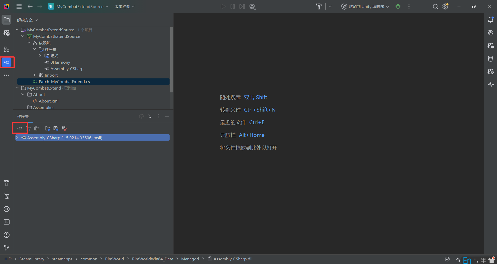

本节介绍使用Harmony库对环世界的方法进行打补丁，同样会以一个简单的案例来说明如何使用Harmony库。

## 一、Harmony库简介

Harmony是利用C#的反射和IL代码修改技术，能够在运行时替换、修补、装饰.NET方法的库。其能够为方法添加前置补丁、后置补丁和辅助补丁，在方法补丁无法生效的情况下，还可以使转译器修改IL字节码。

详细的API说明和用例参见Harmony官网地址：[Harmony官网](https://harmony.pardeike.net/articles/intro.html)

## 二、创建模组

本次案例是做一个对人物技能增强的模组，让技能为小人带来更多的增益效果，如：让格斗等级能够缩短近战的冷却时间。模组目录结构如下：

```text
MyCombatExtend
 - About
   - About.xml
 - Assemblies
```

## 三、编写补丁

### 1. 安装Harmony模组

在Steam创意工坊中订阅：[Harmony](https://steamcommunity.com/workshop/filedetails/?id=2009463077)，订阅后可以直接添加到游戏的模组列表内。

### 2. 编写About.xml文件

在`About\About.xml`文件中写入以下内容：

```xml
<?xml version="1.0" encoding="utf-8"?>

<ModMetaData>
    <name>我的战斗拓展</name> <!--模组名称-->
    <description>我的战斗拓展</description> <!--模组描述-->
    <author>RenXian</author> <!--作者-->
    <supportedVersions> <!--支持的版本-->
        <li>1.4</li>
        <li>1.5</li>
    </supportedVersions>
    <packageId>RenXian.MyCombatExtend</packageId> <!--包名-->
    <modDependencies> <!--模组依赖，声明你的模块依赖了哪些其他的模板，以便于其他玩家去下载-->
        <li>
            <packageId>brrainz.harmony</packageId>
            <displayName>Harmony</displayName>
            <downloadUrl>https://steamcommunity.com/workshop/filedetails/?id=2009463077</downloadUrl>
            <steamWorkshopUrl>https://steamcommunity.com/workshop/filedetails/?id=2009463077</steamWorkshopUrl>
        </li>
    </modDependencies>
</ModMetaData>
```

### 3. 创建C#项目

在创建`MyCombatExtend`目录下一个C#类库项目，命名为`MyCombatExtendSource`，创建过程参加第二节的内容。

### 4. 添加Harmony库引用

引入模组列表中的Harmony库，通常位于`Steam安装目录\steamapps\workshop\content\294100\2009463077\Current\Assemblies`目录下。

可以直接在.csproj文件中添加引用：

```xml

<Reference Include="0Harmony">
    <HintPath>..\..\..\..\..\workshop\content\294100\2009463077\Current\Assemblies\0Harmony.dll</HintPath>
    <Private>False</Private>
</Reference>
```

### 5. 反编译查看目标方法逻辑

使用Rider的反编译功能添加`Assembly-CSharp.dll`查看`VerbProperties.AdjustedCooldown`方法的逻辑，了解其参数和返回值。



反编译得到的代码如下：

```csharp
//tool指的是近战攻击时使用的具体部位，比如拳头、牙齿、刀尖，equipment则是指使用的武器，比如：玻璃钢匕首、速射机枪
public float AdjustedCooldown(Tool tool, Pawn attacker, Thing equipment)
{
  float num = this.defaultCooldownTime; //Def中定义的默认冷却时间
  //如果有tool则说明是近战攻击，计算equipment的冷却时间，equipment为空时，冷却时间则使用Defs中定义的冷却时间*1.0
  if (tool != null) 
    num = tool.AdjustedCooldown(equipment);
  //如果没有tool，则说明是远程攻击，使用equipment的冷却时间
  else if (equipment != null && !this.IsMeleeAttack)
    num = equipment.GetStatValue(StatDefOf.RangedWeapon_Cooldown);
  if (attacker != null)
  {
    //应用冷却因子，这个在自定义的时候可以设置
    if (this.IsMeleeAttack)
      num *= attacker.GetStatValue(StatDefOf.MeleeCooldownFactor);
    else
      num *= attacker.GetStatValue(StatDefOf.RangedCooldownFactor);
  }
  return num;
}

//重载方法，这里多了一个equipmentStuff参数，通常是指武器的材质
public float AdjustedCooldown(
  Tool tool,
  Pawn attacker,
  ThingDef equipment,
  ThingDef equipmentStuff)
{
  float num = this.defaultCooldownTime;
  //这里同理，只是增加了对equipmentStuff的处理
  if (tool != null)
    num = tool.AdjustedCooldown(equipment, equipmentStuff);
  else if (equipment != null && !this.IsMeleeAttack)
    num = equipment.GetStatValueAbstract(StatDefOf.RangedWeapon_Cooldown, equipmentStuff);
  //同上，应用冷却因子
  if (attacker != null)
  {
    if (this.IsMeleeAttack)
      num *= attacker.GetStatValue(StatDefOf.MeleeCooldownFactor);
    else
      num *= attacker.GetStatValue(StatDefOf.RangedCooldownFactor);
  }
  return num;
}
```

### 6. 编写补丁代码

根据上面分析的逻辑，我们需要对冷却时间的最终结果乘以受格斗技能等级影响的系数。格斗技能每升一级，冷却时间降低2.5%。

因此可以对`VerbProperties.AdjustedCooldown`添加一个后置补丁，来修改冷却时间的最终计算结果。

在项目中创建一个类，命名为`Patch_MyCombatExtend`，并编写以下代码：

```csharp
using HarmonyLib;
using RimWorld;
using Verse;

namespace MyCombatExtendSource;

[StaticConstructorOnStartup] // 在游戏启动时加载此类
public class Patch_MyCombatExtend {

    //静构造函数，启动时调用该函数
    static Patch_MyCombatExtend() {
        new Harmony(nameof(Patch_MyCombatExtend)).PatchAll(); // 创建Harmony实例并应用所有补丁
    }


    //近战冷却时间随近战技能等级降低，每级降低2.5%
    //对VerbProperties.AdjustedCooldown方法进行补丁，该方法用于计算攻击的冷却时间
    [HarmonyPatch(typeof(VerbProperties))] //目标类
    [HarmonyPatch(nameof(VerbProperties.AdjustedCooldown))] //目标方法
    [HarmonyPatch(new[] { typeof(Tool), typeof(Pawn), typeof(Thing) })] //目标方法的参数类型列表
    public static class Patch_CooldownMultiplier1 {
        [HarmonyPostfix] //后置补丁，在目标方法执行后调用
        public static void Postfix(ref float __result, VerbProperties __instance, Pawn attacker) {
            if (attacker != null
                && attacker.skills != null
                && !attacker.skills.GetSkill(SkillDefOf.Melee).TotallyDisabled
                && __instance.IsMeleeAttack) {
                //如果攻击者存在没有被禁用的格斗技能，并且当前动作是近战攻击时，我们让最终的冷却时间受格斗技能影响
                __result *= 1 - attacker.skills.GetSkill(SkillDefOf.Melee).Level * 0.025f;
            }

        }
    }

    //对AdjustedCooldown的重载方法进行补丁，逻辑同上
    [HarmonyPatch(typeof(VerbProperties))]
    [HarmonyPatch(nameof(VerbProperties.AdjustedCooldown))]
    [HarmonyPatch(new[] { typeof(Tool), typeof(Pawn), typeof(ThingDef), typeof(ThingDef) })]
    public static class Patch_CooldownMultiplier2 {
        [HarmonyPostfix]
        public static void Postfix(ref float __result, VerbProperties __instance, Pawn attacker) {
            if (attacker != null
                && attacker.skills != null
                && !attacker.skills.GetSkill(SkillDefOf.Melee).TotallyDisabled
                && __instance.IsMeleeAttack) {
                __result *= 1 - attacker.skills.GetSkill(SkillDefOf.Melee).Level * 0.025f;
            }
        }
    }
}
```

### 7. 编译项目并测试

同第二节一样，编译项目后便会在`Assemblies`目录下生成dll文件，由于效果不太明显，这里就不放效果图了，可自行测试。

## 四、总结

本节介绍了如何使用Harmony库对环世界的代码进行打补丁，创建了一个简单的模组来增强近战技能的效果。通过对
`VerbProperties.AdjustedCooldown`方法的补丁，实现了根据近战技能等级来降低近战攻击的冷却时间。